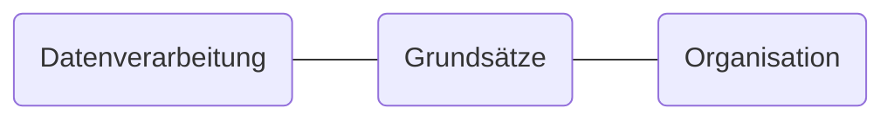

# Datenschutz-Struktur

Innerhalb der Datenschutzstruktur findet eine erste Unterteilung in drei Ebenen statt: Datenverarbeitung, Grundsätze der Datenverarbeitung und Organisation des Datenschutzes.

# Datenverarbeitung (DV)

## DV.1 - [Verantwortliche](Datenverarbeitung/Verantwortliche.md)

- DV 1.1 - [Alleinige Verantwortung](Datenverarbeitung/Alleinige-Verantwortung.md)
- DV 1.2 - [Gemeinsame Verantwortung](Datenverarbeitung/Gemeinsame-Verantwortung.md)
- DV 1.3 - [Auftragsverarbeitung](Datenverarbeitung/Auftragsverarbeitung.md)

## DV.2 - [Betroffene](Datenverarbeitung/Betroffene.md)

## DV.3 - [Dritte](Datenverarbeitung/Dritte.md)

## DV.4 - [Personenbezogene Daten](Datenverarbeitung/Personenbezogene-Daten.md)

- [Schutzstufe](Datenverarbeitung/Schutzstufe.md)
- [Risiko](Datenverarbeitung/Risiko.md)

## DV.5 - [Verarbeitung](Datenverarbeitung/Verarbeitung.md)

- DV.5.1 - [Erhebung](Datenverarbeitung/Erhebung.md)
- DV.5.2 - [Erfassung](Datenverarbeitung/Erfassung.md)
- DV.5.3 - [Organisation](Datenverarbeitung/Organisation.md)
- DV.5.4 - [Ordnen](Datenverarbeitung/Ordnen.md)
- DV.5.5 - [Speichern](Datenverarbeitung/Speicherung.md)
- DV.5.6 - [Veränderung](Datenverarbeitung/Veraenderung.md)
- DV.5.7 - [Datenübermittlung](Datenverarbeitung/Uebermittlung.md)
- DV.5.8 - [Verbreitung](Datenverarbeitung/Verbreitung.md)
- DV.5.9 - [Verknüpfung](Datenverarbeitung/Verknuepfung.md)
- DV.5.10 - [Einschränkung](Datenverarbeitung/Einschraenkung.md)
- DV.5.11 - [Löschung](Datenverarbeitung/Loeschung.md)

## DV.6 - [Verarbeitungstätigkeit](Datenverarbeitung/Verarbeitungstaetigkeit.md)

# Grundsätze der Datenverarbeitung (G)

- G.1 - [Vertraulichkeit](Grundsaetze-Datenverarbeitung/Vertraulichkeit.md) 
- G.2 - [Verfügbarkeit](Grundsaetze-Datenverarbeitung/Verfuegbarkeit.md) 
- G.3 - [Integrität](Grundsaetze-Datenverarbeitung/Integritaet.md) 
- G.4 - [Belastbarkeit](Grundsaetze-Datenverarbeitung/Belastbarkeit.md) 
- G.5 - [Rechtmäßigkeit](Grundsaetze-Datenverarbeitung/Rechtmaessigkeit.md) 
- G.6 - [Zweckbindung](Grundsaetze-Datenverarbeitung/Zweckbindung.md) 
- G.7 - [Erforderlichkeit](Grundsaetze-Datenverarbeitung/Erforderlichkeit.md) 
- G.8 - [Datenminimierung](Grundsaetze-Datenverarbeitung/Datenminimierung.md) 
- G.9 - [Speicherbegrenzung](Grundsaetze-Datenverarbeitung/Speicherbegrenzung.md) 
- G.10 - [Richtigkeit](Grundsaetze-Datenverarbeitung/Richtigkeit.md) 
- G.11 - [Transparenz](Grundsaetze-Datenverarbeitung/Transparenz.md) 
- G.11 - [Rechenschaftspflicht](Grundsaetze-Datenverarbeitung/Rechenschaftspflicht.md) 
- G.12 - [Direkterhebung](Grundsaetze-Datenverarbeitung/Direkterhebung.md) 
- G.13 - [Privacy by design und dafault](Grundsaetze-Datenverarbeitung/Privacybydesignanddefault/index.de) 
- G.13.1 - [Privacy by design](Grundsaetze-Datenverarbeitung/Privacybydesign.md)
- G.13.2 - [Privacy by default](Grundsaetze-Datenverarbeitung/Privacybydefault.md)

# Organisation (O)

- O.1. [Aufbauorganisation](Organisation/Aufbauorganiation.md) 
- O.P. - [Prozesse](Organisation/Prozesse.md) 
  - O.P.X - [Widerspruch](Organisation/Prozess-Widerspruch.md)
  - O.P.X - [Allgemeines Datenschutzmanagement](allgemeines-datenschutzmanagement/index.de) 
    - [Personal](Organisation/Prozess-Personalmanagement.md) 
      - [Belehrung](Organisation/Prozess-Belehrung.md) 
        - Verpflichtung
        - Onboarding
        - Offboarding
      - [Schulung](Organisation/Prozess-Schulung.md)
  - O.P.X - [Auskunft](Organisation/Prozess-Auskunft.md)
  - O.P.X - [Berichtigung](Organisation/Prozess-Berichtigung.md)
  - O.P.X - [Löschung](Organisation/Prozess-Loeschung.md)
  - O.P.X - [Einschränkung](Organisation/Prozess-Einschraenkung.md)
  - O.P.X - [Widerspruch](Organisation/Prozess-Widerspruch.md)
  - O.P.X - [Data Breach](Organisation/Prozess-Data-Breach.md)
  - O.P.X - [LfD-Verfahren](Organisation/Prozess-LfD-Verfahren.md)
  - O.P.X - [Unterlassung](Organisation/Prozess-Unterlassung.md)
  - O.P.X - [Schadensersatz](Organisation/Prozess-Schadensersatz.md)
  - O.P.X - [Erstellung des Verzeichnisses der Verarbeitungstätigketen](Organisation/Prozess-VVT-Erstellung.md)
  - O.P.X - [Erstellung der Risikoanalyse](Organisation/Prozess-Risikoanalyse.md)
  - O.P.X - [Erstellung der Datenschutz-Folgenabschätzung](Organisation/Prozess-DSFA.md)
  - O.P.X - [Prozess - Einführung eines IT-Verfahrens](/Organisation/Prozess-Einf%C3%BChrung-IT-Verfahren.md)
- O.X - [Dokumentation](Organisation/Dokumentation.md) 
- O.3 - [[TOM]](Organisation/Prozess-TOM.md) 
  - O.2.1 - [Informationspflichten](Organisation/Informationspflichten.md)
  - O.2.2 - [Datenschutzerklärung](Organisation/Datenschutzerklaerung.md)
  - O.2.X - [Pseudonymisierung](Organisation/Pseudonymisierung.md)
- O.4 - [Verträge](Organisation/Vertraege.md) 
  - O.4.1 - [Dienstleistungsvertrag](Organisation/Dienstleistungsvertrag.md)
  - 0.4.2 - [Kooperationsvertrag](Organisation/Kooperationsvertrag.md)
  - 0.4.3 - [EVB](Organisation/EVB-IT.md)
  - O.4.4 - [Vertrag zur Auftragsverarbeitung](/Organisation/Vertrag-Auftragsverarbeitung.md)
  - O.4.5 - [Vertrag zur Gemeinsamen Datenverarbeitung](Organisation/Vertrag-Gemeinsame-Verantwortung.md)
- O.5 - [Dienstanweisung](Organisation/Dienstanweisung.md) 
  - O.5.1 - [Dienstanweisung Datenschutz](Organisation/Dienstanweisung-Datenschutz.md)
  - O.5.2 - [Spezielle Dienstanweisungen](Organisation/Spezielle-Dienstanweisungen.md)
- O.6 - [Dienstvereinbarung](Organisation/Dienstvereinbarungen.md) 
  - O.6.1 - [Rahmendienstvereinbarung EDV](Organisation/Rahmendienstvereinbarung-EDV.md)
  - O.6.2 - [Spezielle Dienstvereinbarungen](Organisation/Spezielle-Dienstvereinbarungen.md)
- O.7 - [Rollenbeschreibungen](Organisation/Rollenbeschreibungen.md) 
  - [Hauptverantwortliche](Organisation/Rolle-Hauptverantwortliche.md)
  - [Fachverantwortliche](Organisation/Rolle-Fachverantwortliche.md)
  - [IT-Abteilung](Organisation/Rolle-IT-Abteilung.md)
  - [ISB](Organisation/Rolle-ISB.md)
  - [Organisations-Abteilung](Organisation/Rolle-Organisationsabteilung.md)
  - [Rolle - Personalabteilung](Organisation/Rolle-Personalabteilung.md)
  - [Personalrat](Organisation/Rolle-Personalrat.md)
  - [DSB](Organisation/Rolle-DSB.md)
  - [DSK](Organisation/Rolle-DSK.md)

# Anhänge

- Z.1 - [Über](Anhaenge/Ueber.md) 
- Z.2 - [Änderungen](Anhaenge/Aenderungen.md) 